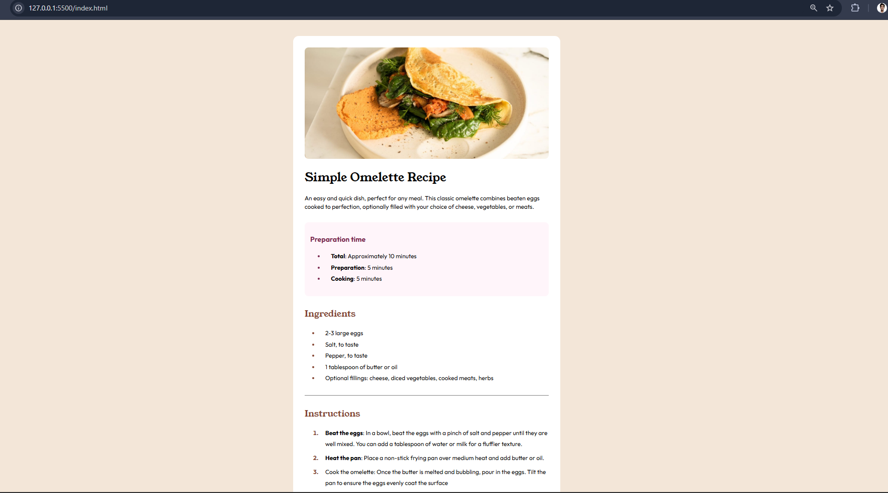
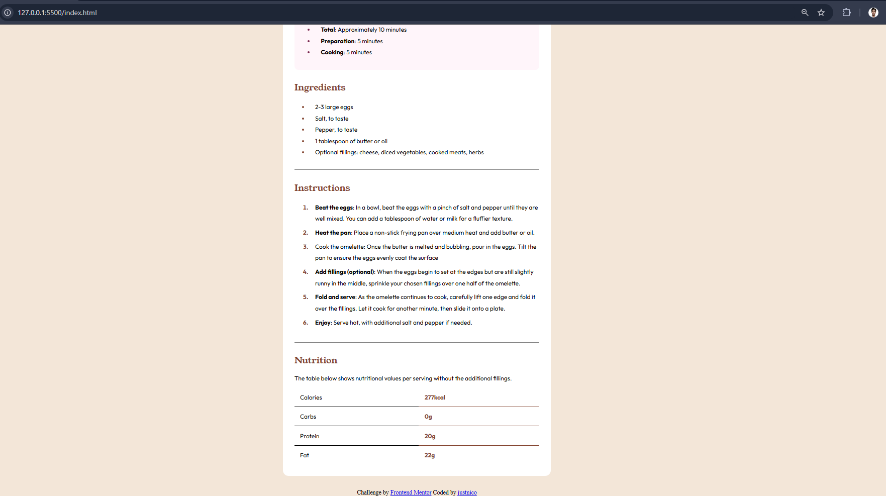

# Frontend Mentor - Recipe page solution

This is a solution to the [Recipe page challenge on Frontend Mentor](https://www.frontendmentor.io/challenges/recipe-page-KiTsR8QQKm). Frontend Mentor challenges help you improve your coding skills by building realistic projects. 

## Table of contents

- [Overview](#overview)
  - [The challenge](#the-challenge)
  - [Screenshot](#screenshot)
  - [Links](#links)
- [My process](#my-process)
  - [Built with](#built-with)
  - [What I learned](#what-i-learned)
  - [Continued development](#continued-development)
  - [Useful resources](#useful-resources)
  - [AI Collaboration](#ai-collaboration)
- [Author](#author)


**Note: Delete this note and update the table of contents based on what sections you keep.**

## Overview

### Screenshot




### Links
//no live site
- Solution URL: [Add solution URL here](https://your-solution-url.com)
- Live Site URL: [Add live site URL here](https://your-live-site-url.com)

## My process

### Built with

- Semantic HTML5 markup
- CSS properties
- Flexbox
- Mobile-first workflow

### What I learned

Usage of pseudo-elements/classes for specific styling elements and the focus structure use of Semantic HTML


```html
 <main>
  <article>

  <header>
    
    <h1>Simple Omelette Recipe</h1>
    <p>An easy and quick dish, perfect for any meal. This classic omelette combines beaten eggs cooked 
  to perfection, optionally filled with your choice of cheese, vegetables, or meats.</p>
  </header>

  <section class="preparation">
    <h3>Preparation time</h3>
  <ul>
    <li><strong>Total</strong>: Approximately 10 minutes</li>
    <li><strong>Preparation</strong>: 5 minutes</li>
    <li><strong>Cooking</strong>: 5 minutes</li>
  </ul>
  </section>
```
```css
  .nutrition-table table tr:last-child td {
      border-bottom: none;
    }

    .nutrition-table table tr td:last-child {
      color: hsl(14, 45%, 36%);
      font-weight: 700;
    }

    .nutrition-table table tr td:first-child {
      font-weight: 400;
    }
     .instructions ol li::marker {
      color: hsl(14, 45%, 36%);
      font-weight: bold;
    }
```

### Continued development

CSS Grid and Positioning and other CSS concepts.

### Useful resources

- [HTML Tables](https://www.w3schools.com/html/html_tables.asp) - This helped me freshen up what Tables are and how they are used.
- [Learn HTML tables in 4 minutes!](https://www.youtube.com/watch?v=aNC6LY34yVM) - The video tutorial gave me an idea on how borders work in tables.

### AI Collaboration

I have used Google AI mode whenever I search for specific help but I go to Gemini once more when I don't get it. 
I asked helped especially on the Table formation, it took me a while just googling so I asked help on how to do it properly.
I didn't ask for code but what concepts are needed to be impelemented and how they work. 


## Author

- Website - [Add your name here](https://www.your-site.com)
- Frontend Mentor - [@@justnico69](https://www.frontendmentor.io/profile/justnico69)


## Acknowledgments

BroCode rocks